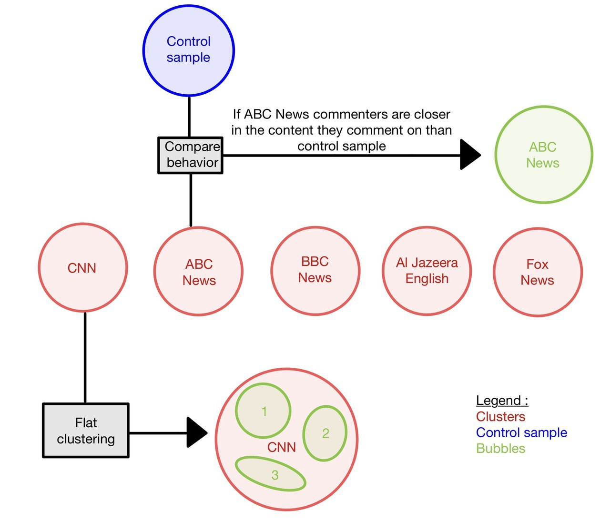

# “Are You Stuck in a YouTube Bubble? It's Time to Expand Your Information Sources!”

Make sure to have all the tools before starting by running the following lines:
```bash
# clone project
git clone <project link>
cd <project repo>

# [OPTIONAL] create conda environment
conda create -n <env_name> python=3.11 or ...
conda activate <env_name>


# install requirements
pip install -r pip_requirements.txt
```
## Repository structure
- 📁 `data`: clean and filtered data saved in the repository
   - `dataset` 
- :file_folder: `src`:
   - `utils.py`: Helper functions used in the notebook.
- `.gitignore`: Specifies files and folders to ignore.
- `README.md`: Main documentation file of the repository, providing an overview and general instructions.
- `pip_requirements.txt`: List of packages required for our code.
- `results.ipynb`: Main results discussed in the Data Story
- `preprocessing.ipynb`: Data cleaning 

## Abstract
The common advice suggests that to stay well-informed, one should diversify its sources. We can define clusters of youtube users, which formed by particularly active people within a channel. These clusters reflect communities invested into the same channel but don't yet imply that they don’t diversify their sources to retrieve information on a particular topic.

Problems can arise when these clusters evolve into bubbles, where users become confined to specific content, limiting exposure to other points of view. In these bubbles, interactions are mostly between individuals who share the same interests, whether it's the same video subjects or channels followed.

In this study, we aim to analyze whether users that frequently interact under News and politics content of a certain channel form a bubble. After identification of clusters based on commenting behavior in the main media channels, we will assess how isolated they are, focusing on whether they cross over into bubbles.

--> link to our [website](https://loulams.github.io/ada-website/)


## Research questions
- Are clusters in our dataset indicative of bubbles with limited perspective diversity ?
- Do commenters of major news channels form bubbles, or do they behave similarly to random Youtube users ?
- How isolated are the bubbles within the News and Politics community ? Can we find reasons for this isolation ?
- For what purpose do the identified bubbles use News and Politics content (e.g politics, daily news, etc.) ? Are the bubbles isolated due to the media they refer to, or the common topics of interest ?

## Additional data
To identify the leading news channels on Youtube, we are using the following [article]( https://pressgazette.co.uk/media-audience-and-business-data/media_metrics/youtube-news-publishers-2023-gb-news-piers-morgan-cnn-fox/). We will focus on the TOP 5, excluding Vox (ranked 5th), as it was founded in 2014, which is not well representated in the timeframe of our data (2005-2019).

## Methods
In order to answer our questions, the data have been handled in the following way. 

### Part 0: Data handling and filtering (preprocessing.ipynb)
As we are dealing with heavy files, we defined readers in `utils.py` that load them chunk by chunk, avoiding memory problems. Videos (yt_metadata_en.json), channels (df_channels_en.tsv) and comments (youtube_comments.tsv) DataFrames were first explored and cleaned by removing irrelevant informations, such as NaNs and empties. We then filtered for those categorized in “News & Politics”, and further kept videos and comments published in our five main channels: CNN, BBC News, ABC News, Al Jazeera English and FOX News (see 'Additional data'). For each main channel, you can find the following plots:
- total number of subscribers, commenters and comments
- number of comments per author
- distribution of comments per author (lin and log scale)

### Part 1: From creation to reaction - understanting Youtube's content dynamics
Here we analyze the most relevant plots from Part 0, to introduce our research.

### Part 2: Uncovering the patterns of the power players of YouTube
In this section, we define clusters with the most active users of each main channel, i.e. the ones that commented the most. After exploring some cutoff methods, such as the mean, median and percentiles (70th, 80th, 95th, 97th and 99th), we select the users with 99th percentile, meaning the 1%. A Venn Diagram underlines users' overlap of the 5 clusters.

### Part 3: A world of similarities - uncovering shared commenting patterns
<div align="center">
   
</div>

- **Compare the clusters of main channels to random pool of Youtube users**, and to each other (figure above, top part)\
In this section we want to see if the clusters can be identified as bubbles, i.e if the users are close in terms of commented videos. To do that, we compute the pairwise ovelap between two users of the same cluster, and between two users from different clusters. The mean pairwise overlap is expressed in terms of [Jaccard Index](https://en.wikipedia.org/wiki/Jaccard_index) (0 = low similarity, 1 = high similarity), which represents the distance between two users. Values are compared to a random sample of Youtube users.

Median, main, percentiles (70th, 80th, 90th) distribution (lin-log and log-log histograms) of pairwise overlaps for each pair of clusters are shown on 2D tables and heatmaps.


- **Examine whether there are bubbles within a cluster** (figure above, bottom part)\
We also look for the presence of multiple bubbles into the same cluster to uncover divergence between the users. The clustering method used is DBSCAN (from [week 9 course](https://docs.google.com/presentation/d/1OWnmnm8oHRBz1JWymxFBNlClpVLLY9ke/edit#slide=id.p45)) with eps = 0.9 and min_samples = 8, taking cosine distances between users as input values for practical data handling reasons. 
Pairwise overlap between the users of the new bubbles will then measure their isolation from one another. The bubbles are first shown by PCA and t-SNE projections for FOX cluster, but as they appeared less adequate, network graphs were preferred. 

We then evaluate the closeness and isolation of the generated bubbles with Jaccard Indices as described in the previous step, and show for each channel the Box Plot of mean pairwise overlap of the bubbles. A heatmap shows the mean Jacard indices between each pair of the main (i.e. biggest) bubbles in each cluster.

For the seek of Part 4, we select 3 bubbles per cluster based on the highest mean pairwise overlap and the minimum size of 10 users. Heatmaps of the mean pairwise overlap are shown for the selected bubbles.

### Part 4: Peering into the bubbles - exploring content and source diversity
For the 3 bubbles in each channel identified in Part 3, we look at the following properties :

- **Diversification of sources**\
In this part, we look at the repartition across all the News&Politics channels of the videos commented by the users (all, and >1%) of each cluster, and plot it as Pie Charts. 

- **Content pattern**\
The last investigation is on the descriptions of all video commented by the users from the bubbles selected in Part 3. We count how many times the leaders Trump, Obama, Cameron,Al Thani and Poutin, as well as the topics climate, education, gender, religion and abortion are employed.

## Internal timeline 
|Timeframe | Tasks | 
|--------|--------------|
|Week 10 | <ol><li>Pairwise overlap algorithm</li><li>Bubbles analysis resp. random users</li><li>Degree of isolation</li></ol>| 
|Week 11  | <ol><li>Bubbles identification</li><li>Plots for data visualization</li><li>Website familiarization and initiation</li></ol>| 
|Week 12      | <ol><li>Bubbles analysis and closeness</li><ol>| 
|Week 13      |<ol><li>Website development</li><li>Data story refining</li></ol>| 
|Week 14  | <ol><li>Website refining</li><li>Code and readme cleaning</li></ol>| 

## Milestone & team organization
- **22.11.2024**: week 10 tasks   (Mila, Lou-Anne, Andreas)
- **29.11.2024**: week 11 tasks   (Manon, Hortense, Mila)
- **06.12.2024**: week 12 tasks   (Lou-Anne, Andreas)
- **13.12.2024**: week 13 tasks   (Manon, Hortense)
- **20.12.2024**: week 14 tasks   (All)
